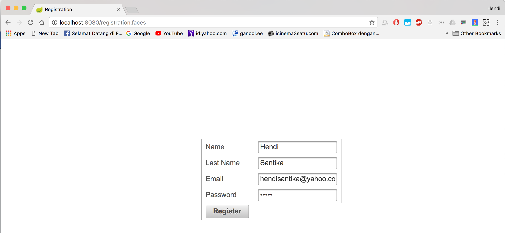
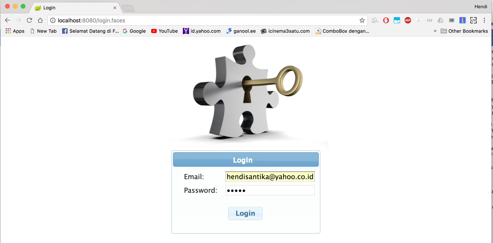
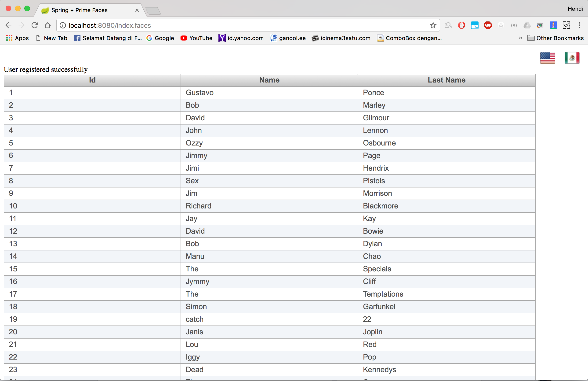

# Spring Boot integration with Prime Faces
- Localization
- Loging (external file(debug, error) & console)
- JPA Repositories
- MySQL Database
- Email notifications (smtp gmail)
- Spring Security

## Things to do:
1. Clone repository:
    ```
    git clone https://github.com/hendisantika/spring-boot-prime-faces.git
    ```
2. Go the folder:
    ```
    cd spring-boot-prime-faces
    ```
3. Run the app:
    ```
    mvn clean spring-boot:run
    ```

When you will launch the application for the first time, go to application.properties file and set spring.datasource.initialize=true (return the value to false when the application will be relaunched)

To DO Things :
1. Go to http://localhost:8080/registration.faces and register your user




2. Go to http://localhost:8080/login.faces and login with your credentials




3. Go to http://localhost:8080/admin/index.faces to see employee list


